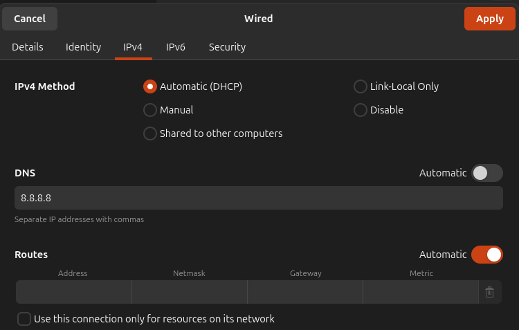

# How to change name server on Ubuntu permanently

_Written by [**Kaan Akşit**](https://kaanaksit.com), 20 February 2025_

**Disclamer:** This article is only tested under Ubuntu 24.10.

I encountered this issue with an institution that I had a few computers running in their office spaces. Any ethernet connection I had in that place with any computers lead to this strange nameserver and blocking me having an access to webpages over the internet. 

To force a certain name server in `Ubuntu`, firstly add these name servers to `/etc/systemd/resolved.conf` as in this example:

```
#  This file is part of systemd.
#
#  systemd is free software; you can redistribute it and/or modify it under the
#  terms of the GNU Lesser General Public License as published by the Free
#  Software Foundation; either version 2.1 of the License, or (at your option)
#  any later version.
#
# Entries in this file show the compile time defaults. Local configuration
# should be created by either modifying this file (or a copy of it placed in
# /etc/ if the original file is shipped in /usr/), or by creating "drop-ins" in
# the /etc/systemd/resolved.conf.d/ directory. The latter is generally
# recommended. Defaults can be restored by simply deleting the main
# configuration file and all drop-ins located in /etc/.
#
# Use 'systemd-analyze cat-config systemd/resolved.conf' to display the full config.
#
# See resolved.conf(5) for details.

[Resolve]
# Some examples of DNS servers which may be used for DNS= and FallbackDNS=:
# Cloudflare: 1.1.1.1#cloudflare-dns.com 1.0.0.1#cloudflare-dns.com 2606:4700:4700::1111#cloudflare-dns.com 2606:4700:4700::1001#cloudflare-dns.com
# Google:     8.8.8.8#dns.google 8.8.4.4#dns.google 2001:4860:4860::8888#dns.google 2001:4860:4860::8844#dns.google
# Quad9:      9.9.9.9#dns.quad9.net 149.112.112.112#dns.quad9.net 2620:fe::fe#dns.quad9.net 2620:fe::9#dns.quad9.net
DNS= 1.1.1.1 9.9.9.9
FallbackDNS= 8.8.8.8
#Domains=
#DNSSEC=no
#DNSOverTLS=no
#MulticastDNS=no
#LLMNR=no
#Cache=yes
#CacheFromLocalhost=no
DNSStubListener=no
#DNSStubListenerExtra=
#ReadEtcHosts=yes
#ResolveUnicastSingleLabel=no
#StaleRetentionSec=0
```

Note that it is critical to set `DNSStubListener=no besides `DNS` and `FallbackDNS` keys. Later on, you can use the classical network manager to set the name server of your choice as in this screenshot:
<figure markdown>
  { width="600" }
</figure>

Once you made these changes, simply reboot your machine. This should give you a permanent name server setting which you could change as you wish in the future.

